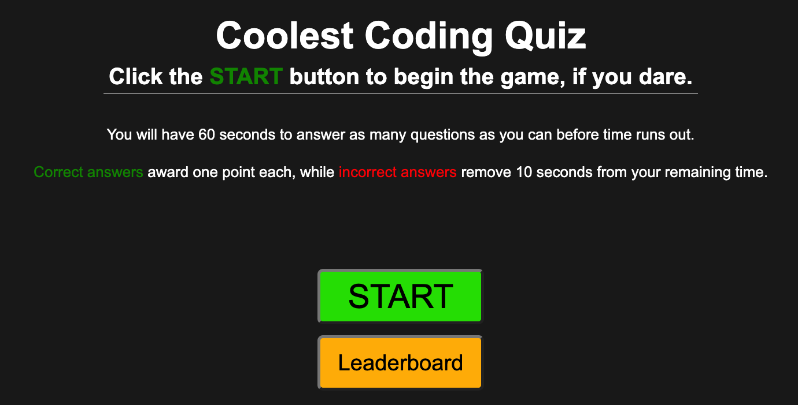

# parker-brook-code-quiz-challenge04
Repo for Challenge 04 - Code Quiz

## Description
This project is a coding quiz that tasks players with answering as many coding-related questions as possible before the time runs out. Once the game ends, players can submit their initials and score to a leaderboard where they can compare themselves to past players.

Link to deployed quiz: https://pbodybrooks.github.io/parker-brook-code-quiz-challenge04/

## Screenshot

## Installation
N/A

## Credits
I had to lean on online resources such as substack quite heavily to complete the leaderboard and score saving section. 

## License
Please refer to repo.

## Features
This project features the use of JavaScript, HTML, and CSS to create the quiz. It includes a timer, for loops and if statements, event listeners, and local storage. There are many clickable buttons that navigate the user to different parts of the quiz, such as the start page, the quiz itself, the end screen, and the leaderboard.
